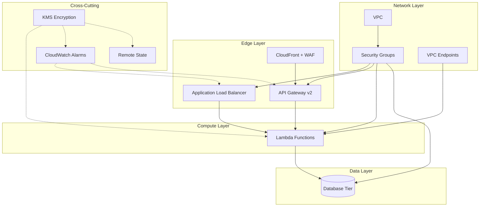

# Cloud Voyager Infra


Production-hardened OpenTofu modules for AWS, aligned with the **AWS Well-Architected Framework** and **FedRAMP** security controls (NIST 800-53). Built by **Cloud Alchemist**.

---

**What this repo demonstrates:**

- **11 reusable modules** covering networking, compute, security, observability, encryption, and state management
- **6 reference architectures** showing how modules compose into real-world deployments
- **FedRAMP/NIST 800-53 alignment** with 15+ security controls mapped to infrastructure
- **Multi-tenant isolation patterns** including token vending, tenant metering, and row-level DynamoDB partitioning
- **Automated CI/CD pipeline** with `tofu plan`, Infracost cost estimation, Trivy, and Checkov security scanning
- **Per-module architecture diagrams** with Mermaid for every component

---

## Architecture Overview



> Per-module architecture diagrams: [docs/architecture/](docs/architecture/)

---

## Design Philosophy

This repository is built on five engineering principles:

| Principle | How it's applied |
| :--- | :--- |
| **Least Privilege** | Every IAM policy uses explicit actions scoped to specific resources. No `*` wildcards for actions. Permission boundaries on all assumable roles. |
| **Defense in Depth** | Layered security groups (web > app > db), WAF at the edge, KMS encryption at rest, TLS in transit, VPC endpoints for private AWS API access. |
| **Immutable Infrastructure** | `create_before_destroy` lifecycles, `name_prefix` for zero-downtime replacements, `prevent_destroy` on stateful resources. |
| **Module Composability** | Each module is independently versioned, tested, and documented. Example patterns show how modules compose without tight coupling. |
| **Compliance as Code** | FedRAMP controls (SC-7, AC-6, AU-2, SC-28, etc.) are enforced through OpenTofu `validation` blocks, `check` assertions, and CI policy scanning. |

---

## Modules

Reusable, independently versioned modules in [`infra/modules/`](infra/modules/).

### Networking

| Module | Description | FedRAMP Controls | Docs |
| :--- | :--- | :--- | :--- |
| **vpc** | VPC with public/private subnets across multiple AZs, Internet Gateway, optional NAT Gateway, VPC Flow Logs with KMS encryption, and hardened default resources | AU-2, SC-7, SC-28 | [README](infra/modules/vpc/README.md) |
| **security_groups** | Tiered security groups for web, app, database, and bastion tiers with optional restricted egress, configurable ingress CIDRs, and production safety checks | AC-4, SC-7 | [README](infra/modules/security_groups/README.md) |
| **vpc_endpoints** | Gateway VPC Endpoints for S3 and DynamoDB, routing traffic over the AWS private backbone to eliminate NAT costs and public internet exposure | SC-7, AC-4, SC-8 | [README](infra/modules/vpc_endpoints/README.md) |

### Edge & Routing

| Module | Description | FedRAMP Controls | Docs |
| :--- | :--- | :--- | :--- |
| **alb** | Application Load Balancer with HTTPS redirect, TLS termination, WAF integration, access logging, and connection draining | SC-7, SC-8, AU-2 | [README](infra/modules/alb/README.md) |
| **api_gateway** | Shared API Gateway v2 (HTTP API) with access logging, throttling, CORS, VPC Link, JWT authorizer, and KMS-encrypted logs | AU-2, SC-7, SC-8, IA-2 | [README](infra/modules/api_gateway/README.md) |
| **api_gateway_routes** | Per-service route isolation for shared API Gateways with state isolation, route prefix collision prevention, and zero-downtime lifecycle management | AC-6, SC-7 | [README](infra/modules/api_gateway_routes/README.md) |
| **cloudfront_waf** | CloudFront distribution with WAFv2 Web ACL for Layer 7 protection of HTTP API v2 endpoints that cannot directly associate with WAFv2 | SC-7, SI-4 | [Source](infra/modules/cloudfront_waf/) |

### Compute

| Module | Description | FedRAMP Controls | Docs |
| :--- | :--- | :--- | :--- |
| **lambda** | FedRAMP-compliant Lambda functions with KMS-encrypted environment variables, least-privilege IAM, optional VPC deployment, X-Ray tracing, dead-letter queues, and function URLs | SC-8, SC-28, AC-6, AU-2, SI-4 | [README](infra/modules/lambda/README.md) |

### Security & Encryption

| Module | Description | FedRAMP Controls | Docs |
| :--- | :--- | :--- | :--- |
| **kms** | Customer-managed KMS keys with automatic rotation, least-privilege key policies, and service-specific access grants for CloudWatch Logs and S3 | SC-12, SC-13, SC-28 | [README](infra/modules/kms/README.md) |

### Observability

| Module | Description | FedRAMP Controls | Docs |
| :--- | :--- | :--- | :--- |
| **cloudwatch_alarms** | Configurable CloudWatch metric alarms for ALB, API Gateway, and VPC Flow Logs with SNS notifications and optional auto-remediation via Lambda | SI-4, SI-5, IR-4, AU-6 | [README](infra/modules/cloudwatch_alarms/README.md) |

### State Management

| Module | Description | FedRAMP Controls | Docs |
| :--- | :--- | :--- | :--- |
| **remote_state** | S3 + DynamoDB backend for OpenTofu state with encryption at rest, state locking, versioning, and access logging | SC-8, SC-28, AU-2, AC-6 | [README](infra/modules/remote_state/README.md) |

---

## Example Patterns

Reference architectures in [`infra/example_infra_patterns/`](infra/example_infra_patterns/) showing how modules compose into production deployments.

| Pattern | Description | Docs |
| :--- | :--- | :--- |
| **networking** | Root networking configuration wiring VPC, subnets, security groups, and VPC endpoints together | [Source](infra/example_infra_patterns/networking/) |
| **api_gateway_platform** | Shared API Gateway v2 deployment owned by the platform team, enabling multi-team route attachment via state isolation | [Source](infra/example_infra_patterns/api_gateway_platform/) |
| **api_gateway_service** | Service team route attachment to a shared API Gateway, reading platform state via `terraform_remote_state` for blast-radius control | [Source](infra/example_infra_patterns/api_gateway_service/) |
| **mcp_server** | Production-ready MCP server on Lambda + API Gateway v2 with Cognito OAuth 2.0, KMS encryption, CloudWatch alarms, and multi-tenant isolation | [README](infra/example_infra_patterns/mcp_server/README.md) |
| **mcp_token_vending_machine** | Tenant-scoped IAM credentials via STS AssumeRole with permission boundaries, session tags, and template tenant roles | [README](infra/example_infra_patterns/mcp_token_vending_machine/README.md) |
| **mcp_tenant_metering** | Per-tenant API usage tracking via DynamoDB with CloudWatch metric filters, quota alarms, and SNS notifications | [README](infra/example_infra_patterns/mcp_tenant_metering/README.md) |

---

## Quick Start

```bash
cd infra/example_infra_patterns/networking

# Copy and edit the example variables
cp terraform.tfvars.example terraform.tfvars

# Initialize providers
tofu init

# Preview changes
tofu plan

# Apply infrastructure
tofu apply
```

Reference modules from external repositories via versioned git source:

```hcl
module "vpc" {
  source = "git::https://github.com/jsandov/cloud-voyager-infra.git//infra/modules/vpc?ref=v1.0.0"

  cidr_block         = "10.0.0.0/16"
  environment        = "prod"
  availability_zones = ["us-east-1a", "us-east-1b", "us-east-1c"]

  public_subnet_cidrs  = ["10.0.1.0/24", "10.0.2.0/24", "10.0.3.0/24"]
  private_subnet_cidrs = ["10.0.11.0/24", "10.0.12.0/24", "10.0.13.0/24"]
}
```

---

## CI/CD Pipeline

Pull requests modifying `infra/**` trigger automated checks via GitHub Actions:

| Check | Tool | Purpose |
| :--- | :--- | :--- |
| Formatting | `tofu fmt -check` | Enforce consistent HCL formatting |
| Validation | `tofu validate` | Catch configuration errors before plan |
| Plan | `tofu plan` | Preview infrastructure changes (posted as PR comment) |
| Linting | `tflint` | Detect provider-specific issues and best practice violations |
| Cost Estimation | `infracost diff` | Cost impact analysis posted as PR comment |
| Misconfiguration Scan | `trivy config` | Detect security misconfigurations (HIGH/CRITICAL) |
| Policy Compliance | `checkov` | Policy-as-code compliance checks against CIS/FedRAMP benchmarks |

CI actions are pinned to immutable SHAs to prevent supply chain attacks. See [Infracost Setup Guide](docs/infracost-setup.md) for configuring CI secrets.

---

## Security Controls

| Control Area | Implementation |
| :--- | :--- |
| **Encryption at rest (SC-28)** | KMS customer-managed keys for logs, state, Lambda environment variables, and data stores |
| **Encryption in transit (SC-8)** | TLS everywhere — HTTPS-only ALB, API Gateway, CloudFront |
| **Least privilege (AC-6)** | Scoped IAM policies with explicit actions, permission boundaries on assumable roles |
| **Network segmentation (SC-7)** | Tiered security groups, restricted egress, WAF at edge, VPC endpoints for private access |
| **Audit logging (AU-2)** | VPC Flow Logs, CloudWatch access logs, S3 access logs, API Gateway request logs |
| **Continuous monitoring (SI-4)** | CloudWatch alarms with SNS alerting and optional Lambda auto-remediation |
| **Key management (SC-12)** | KMS automatic key rotation, least-privilege key policies, service-specific grants |
| **State protection (SC-8, AC-6)** | Encrypted S3 backend with DynamoDB locking, versioning, restricted access |
| **Supply chain (SA-11)** | Pinned provider versions, pinned CI action SHAs, automated security scanning |

---

## Project Metrics

| Metric | Count |
| :--- | :--- |
| Reusable modules | 11 |
| Reference architectures | 6 |
| FedRAMP controls covered | 15+ |
| CI pipeline checks | 7 |
| Architecture diagrams | 12 |

---

## Project Structure

```text
cloud-voyager-infra/
├── infra/
│   ├── modules/                          # Reusable infrastructure modules
│   │   ├── vpc/                          # VPC + subnets + NAT + flow logs
│   │   ├── security_groups/              # Tiered SGs (web/app/db/bastion)
│   │   ├── alb/                          # Application Load Balancer + WAF
│   │   ├── api_gateway/                  # Shared API Gateway v2 (HTTP API)
│   │   ├── api_gateway_routes/           # Per-service route isolation
│   │   ├── cloudfront_waf/               # CloudFront + WAFv2 edge protection
│   │   ├── kms/                          # Customer-managed encryption keys
│   │   ├── lambda/                       # FedRAMP-compliant Lambda functions
│   │   ├── remote_state/                 # S3 + DynamoDB state backend
│   │   ├── cloudwatch_alarms/            # SNS + alarms for observability
│   │   └── vpc_endpoints/                # S3 + DynamoDB Gateway endpoints
│   └── example_infra_patterns/           # Reference implementations
│       ├── networking/                   # Root networking config
│       ├── api_gateway_platform/         # Shared API Gateway (platform team)
│       ├── api_gateway_service/          # Service route isolation (service team)
│       ├── mcp_server/                   # MCP server on Lambda + API Gateway
│       ├── mcp_token_vending_machine/    # Tenant-scoped IAM via STS
│       └── mcp_tenant_metering/          # Per-tenant usage tracking
├── docs/
│   ├── architecture/                     # Per-module Mermaid diagrams
│   └── infracost-setup.md                # CI cost estimation setup guide
└── .github/
    └── workflows/
        └── tofu-plan.yml                 # CI: plan + security scan + cost estimation
```

---

## License

MIT
