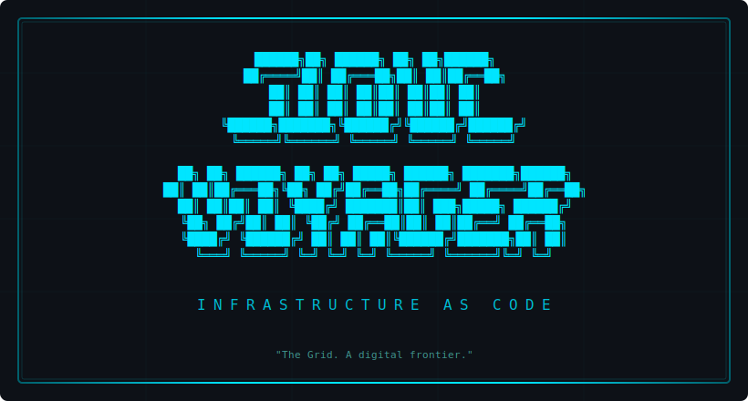

<p align="center">
  
</p>

<p align="center">
  
  
  
  
</p>

<p align="center">
  <em>"The Grid. A digital frontier. I tried to picture clusters of information<br>as they moved through the computer..."</em>
</p>

---

<br>

> **`> SYSTEM BOOT :: CLOUD-VOYAGER-INFRA v1.0`**
>
> Production-hardened OpenTofu modules for AWS. Reusable, versioned, and aligned with the **AWS Well-Architected Framework** and **FedRAMP** security controls.

<br>

## `/// GRID MAP`

```text
cloud-voyager-infra/
├── CLAUDE.md                        // Project conventions & security practices
├── docs/
│   ├── architecture/                // Per-module Mermaid diagrams
│   │   ├── vpc.md
│   │   ├── security-groups.md
│   │   ├── alb.md
│   │   ├── api-gateway.md
│   │   ├── kms.md
│   │   ├── remote-state.md
│   │   └── cloudwatch-alarms.md
│   └── infracost-setup.md           // CI cost estimation setup guide
├── infra/
│   ├── modules/
│   │   ├── vpc/                     // VPC + subnets + NAT + flow logs
│   │   ├── security_groups/         // Tiered SGs (web/app/db/bastion)
│   │   ├── alb/                     // Application Load Balancer + WAF
│   │   ├── api_gateway/             // API Gateway v2 (HTTP API)
│   │   ├── kms/                     // Customer-managed encryption keys
│   │   ├── remote_state/            // S3 + DynamoDB state backend
│   │   └── cloudwatch_alarms/       // SNS + alarms for observability
│   ├── main.tf                      // Root config — wires modules
│   ├── variables.tf                 // Root-level variables
│   ├── outputs.tf                   // Root-level outputs
│   ├── providers.tf                 // AWS provider config
│   ├── versions.tf                  // Version constraints
│   └── terraform.tfvars.example     // Example variable values
└── .github/
    └── workflows/
        └── tofu-plan.yml            // CI: plan + Infracost + security scan
```

<br>

## `/// INITIALIZE`

```bash
cd infra

# Load configuration
cp terraform.tfvars.example terraform.tfvars
# Edit terraform.tfvars with your values

# Connect to the Grid
tofu init

# Scan the horizon
tofu plan

# Enter the Grid
tofu apply
```

<br>

## `/// PROGRAM DIRECTORY`

> Each module is independently versioned and documented. Click to access the module's identity disc.

<br>

<table>
<tr>
<td width="50%" valign="top">

### `[VPC]`
**Network Foundation**

VPC with public/private subnets across multiple AZs, Internet Gateway, optional NAT Gateway, VPC Flow Logs with KMS encryption, and hardened default resources.

`FedRAMP: AU-2 · SC-7 · SC-28`

[`> ACCESS DISC`](infra/modules/vpc/README.md)

</td>
<td width="50%" valign="top">

### `[SECURITY GROUPS]`
**Access Control Layer**

Tiered security group patterns for web, application, database, and bastion tiers. Optional restricted egress with per-tier port allowlists.

`FedRAMP: AC-4 · SC-7`

[`> ACCESS DISC`](infra/modules/security_groups/README.md)

</td>
</tr>
<tr>
<td width="50%" valign="top">

### `[ALB]`
**Edge Gateway**

Application Load Balancer with HTTPS redirect, TLS termination, WAF integration, access logging, and connection draining.

`FedRAMP: SC-7 · SC-8 · AU-2`

[`> ACCESS DISC`](infra/modules/alb/README.md)

</td>
<td width="50%" valign="top">

### `[API GATEWAY]`
**Service Mesh Interface**

API Gateway v2 (HTTP API) with access logging, throttling, optional CORS, VPC Link for private backends, and WAF association.

`FedRAMP: AU-2 · AU-9 · SC-7 · SC-8`

[`> ACCESS DISC`](infra/modules/api_gateway/README.md)

</td>
</tr>
<tr>
<td width="50%" valign="top">

### `[KMS]`
**Encryption Core**

Customer-managed KMS keys with automatic rotation, least-privilege key policies, and service-specific access grants for CloudWatch Logs and S3.

`FedRAMP: SC-12 · SC-13 · SC-28`

[`> ACCESS DISC`](infra/modules/kms/README.md)

</td>
<td width="50%" valign="top">

### `[REMOTE STATE]`
**State Persistence**

S3 + DynamoDB backend for OpenTofu state with encryption at rest, state locking, versioning, and optional access logging.

`FedRAMP: SC-8 · SC-28 · AU-2 · AC-6`

[`> ACCESS DISC`](infra/modules/remote_state/README.md)

</td>
</tr>
<tr>
<td width="50%" valign="top">

### `[CLOUDWATCH ALARMS]`
**Threat Monitor**

SNS topic with KMS encryption and configurable alarms for ALB errors, API Gateway latency, and VPC flow log anomalies. Optional Lambda remediation.

`FedRAMP: SI-4 · SI-5 · IR-4 · AU-6`

[`> ACCESS DISC`](infra/modules/cloudwatch_alarms/README.md)

</td>
<td width="50%" valign="top">

### `[CI/CD PIPELINE]`
**Automated Sentinel**

GitHub Actions workflow: `tofu plan` + `tofu validate` + `tofu fmt` on every PR. Infracost cost estimates and Trivy/Checkov security scanning.

`FedRAMP: SA-11 · CM-3 · SC-8`

[`> ACCESS DISC`](.github/workflows/tofu-plan.yml)

</td>
</tr>
</table>

<br>

## `/// LINK TO GRID`

Reference modules from external repositories via versioned git source:

```hcl
module "vpc" {
  source = "git::https://github.com/jsandov/cloud-voyager-infra.git//infra/modules/vpc?ref=v1.0.0"

  cidr_block         = "10.0.0.0/16"
  environment        = "prod"
  availability_zones = ["us-east-1a", "us-east-1b", "us-east-1c"]

  public_subnet_cidrs  = ["10.0.1.0/24", "10.0.2.0/24", "10.0.3.0/24"]
  private_subnet_cidrs = ["10.0.11.0/24", "10.0.12.0/24", "10.0.13.0/24"]
}
```

<br>

## `/// AUTOMATED DEFENSES`

Pull requests modifying `infra/**` trigger the CI sentinel:

| Check | Purpose |
| :--- | :--- |
| `tofu fmt -check` | Enforce consistent formatting |
| `tofu validate` | Catch configuration errors |
| `tofu plan` | Preview infrastructure changes |
| `infracost diff` | Cost impact posted as PR comment |
| `trivy config` | Scan for misconfigurations |
| `checkov` | Policy-as-code compliance checks |

See [Infracost Setup Guide](docs/infracost-setup.md) for configuring CI secrets.

<br>

## `/// SECURITY PROTOCOL`

| Control | Implementation |
| :--- | :--- |
| **Encryption at rest** | KMS customer-managed keys for logs, state, and data |
| **Encryption in transit** | TLS everywhere — HTTPS-only ALB, API Gateway |
| **Least privilege** | Scoped IAM policies, tiered security groups |
| **Audit trail** | VPC Flow Logs, CloudWatch access logs, S3 access logs |
| **Monitoring** | CloudWatch alarms with SNS alerting |
| **State protection** | Encrypted S3 backend with DynamoDB locking |
| **Supply chain** | Pinned provider and CI action versions |

<br>

## `/// DIRECTIVES`

See [CLAUDE.md](CLAUDE.md) for project conventions, security practices, and module authoring guidelines.

See [docs/architecture/](docs/architecture/) for per-module architecture diagrams.

<br>

---

<p align="center">
  <sub><code>END OF LINE</code></sub>
</p>
