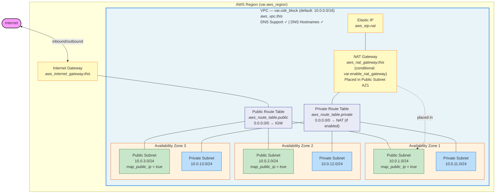

# Infrastructure Architecture

This diagram represents the AWS VPC infrastructure provisioned by the `infra/modules/vpc` module.

## VPC Network Topology

## Resource Summary

| Resource | Count | Conditional |
| --- | --- | --- |
| `aws_vpc` | 1 | No |
| `aws_internet_gateway` | 1 | No |
| `aws_subnet` (public) | 3 (one per AZ) | No |
| `aws_subnet` (private) | 3 (one per AZ) | No |
| `aws_route_table` (public) | 1 | No |
| `aws_route_table` (private) | 1 | No |
| `aws_route` (public → IGW) | 1 | No |
| `aws_route` (private → NAT) | 1 | `var.enable_nat_gateway` |
| `aws_route_table_association` (public) | 3 | No |
| `aws_route_table_association` (private) | 3 | No |
| `aws_nat_gateway` | 1 | `var.enable_nat_gateway` |
| `aws_eip` | 1 | `var.enable_nat_gateway` |

## Key Design Decisions

- **Single NAT Gateway** in AZ1 for cost efficiency — suitable for dev/staging. For production HA, deploy one NAT per AZ.
- **Subnet CIDRs** computed dynamically via `cidrsubnet()` — public subnets use offsets 1-3, private subnets use offsets 11-13.
- **3 AZs** selected automatically from available zones in the region via `data.aws_availability_zones`.
- **NAT Gateway** is conditional (`var.enable_nat_gateway`, default `false`) to avoid cost when not needed.
- **Default tags** (`ManagedBy = "opentofu"`, `Environment`) applied at both provider level and resource level.
