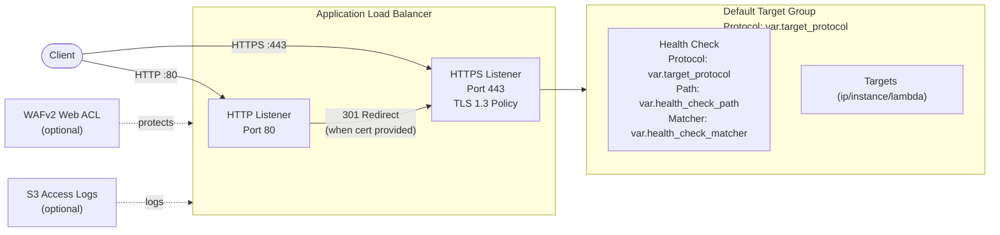

# ALB Architecture

## Design Decisions

- **TLS 1.3 by default**: Uses `ELBSecurityPolicy-TLS13-1-2-2021-06`
- **HTTP→HTTPS redirect**: Automatic when `certificate_arn` is provided
- **Drop invalid headers**: `drop_invalid_header_fields = true` prevents request smuggling
- **Configurable target protocol**: `target_protocol` variable (HTTP or HTTPS) enables end-to-end encryption when backends support TLS
- **Target type `ip`**: Default supports Fargate and container deployments
- **Deletion protection**: Off by default for dev, enable for production
