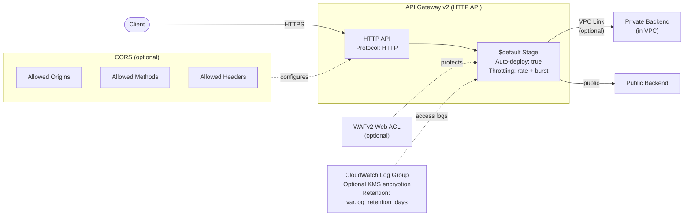

# API Gateway Architecture

## Design Decisions

- **HTTP API v2**: Lower latency and cost vs REST API v1
- **Access logging**: Enabled by default with 90-day retention
- **Throttling**: Configurable rate and burst limits
- **VPC Link**: Optional private backend connectivity
- **No IAM role needed**: HTTP API v2 access logging works natively
