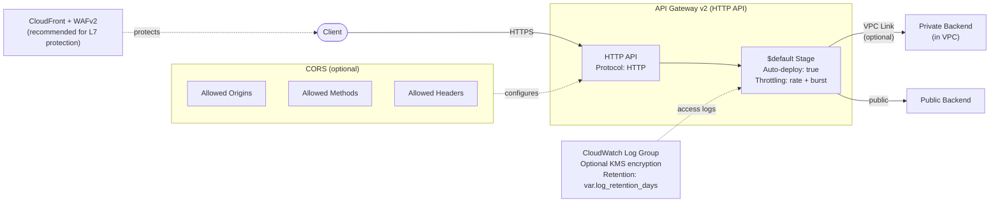

# API Gateway Architecture

## Design Decisions

- **HTTP API v2**: Lower latency and cost vs REST API v1
- **Access logging**: Enabled by default with 90-day retention
- **Throttling**: Configurable rate and burst limits per route and at the default stage level
- **VPC Link**: Optional private backend connectivity
- **No IAM role needed**: HTTP API v2 access logging works natively (unlike REST API v1)
- **JWT Authorizer**: Native JWT validation on the shared gateway; downstream route modules reference the authorizer_id

## Known Limitations

- **WAFv2 not supported on HTTP API v2**: AWS WAFv2 can only be associated with REST APIs, ALBs, CloudFront, AppSync, Cognito, App Runner, Verified Access, and Amplify. HTTP API v2 stages are not a supported resource type. For Layer 7 protection, place a **CloudFront distribution** in front of the HTTP API and associate WAF with CloudFront.
- **30-second integration timeout**: HTTP API v2 has a hard 30-second maximum integration timeout that cannot be increased. This limits SSE streaming and long-running Lambda invocations. For workloads needing longer timeouts, consider REST API with response streaming or Lambda Function URLs.
- **300 routes per API**: Default quota, increasable via AWS Service Quotas.
- **300 integrations per API**: Hard limit, not increasable. Each service team consumes one integration.
