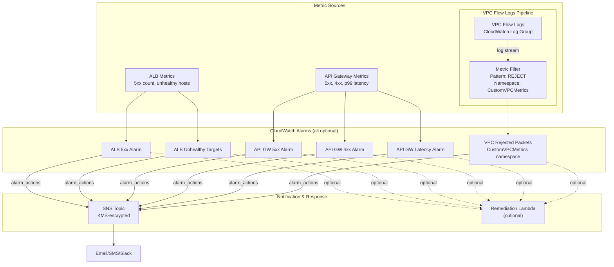

# CloudWatch Alarms Architecture

## Design Decisions

- **All alarms optional**: Each gated by `enable_*` variable
- **Metric filter for VPC Flow Logs**: VPC Flow Logs don't publish native CloudWatch metrics; a `aws_cloudwatch_log_metric_filter` extracts rejected packet counts into a custom namespace (`CustomVPCMetrics`)
- **SNS encrypted**: Topic uses customer-managed KMS key
- **treat_missing_data = notBreaching**: Avoids false alarms when metrics are absent
- **Configurable thresholds**: Period, evaluation periods, and threshold per alarm
- **Lambda remediation**: Optional automatic incident response
