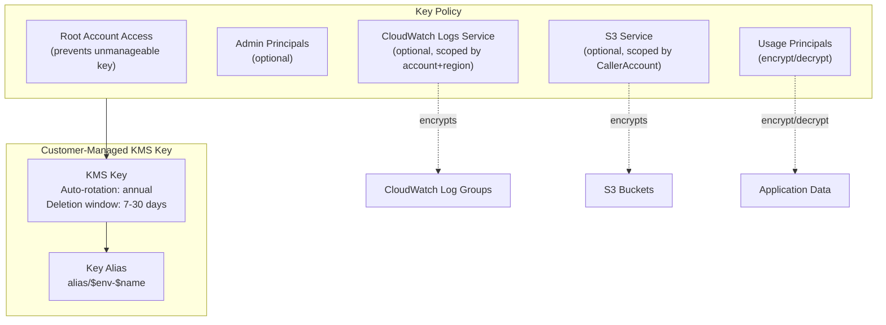

# KMS Architecture

## Design Decisions

- **Automatic rotation**: Key material rotated annually (FedRAMP SC-12)
- **Root account access**: Required to prevent key from becoming unmanageable
- **Service-scoped access**: CloudWatch and S3 access gated by boolean toggles
- **CallerAccount condition**: S3 policy restricts to same-account usage only
- **No wildcard principals**: Key policy never grants access to `*`
