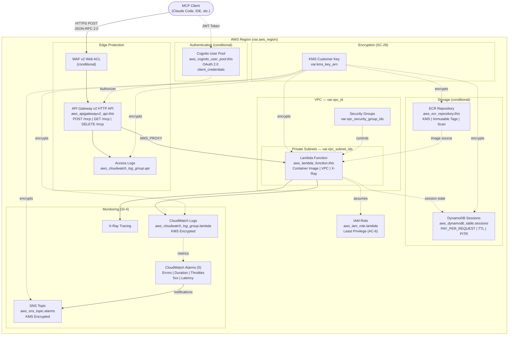

# MCP Server Architecture

## FedRAMP Control Mapping

| Control | ID | Implementation |
| --- | --- | --- |
| Boundary Protection | SC-7 | VPC required, WAF optional, security groups |
| Transmission Confidentiality | SC-8 | TLS on API Gateway, HTTPS-only |
| Cryptographic Key Management | SC-12/13 | KMS customer-managed key (required) |
| Encryption at Rest | SC-28 | KMS for env vars, logs, DynamoDB, ECR |
| Least Privilege | AC-6 | Scoped IAM role, no wildcard actions |
| Audit Logging | AU-2/3 | CloudWatch logs + API Gateway access logs |
| Monitoring | SI-4 | X-Ray tracing, 5 CloudWatch alarms |
| Incident Handling | IR-4 | SNS alarm notifications |
| Authentication | IA-2/8 | Cognito OAuth 2.0 JWT authorizer |
| Least Functionality | CM-7 | Reserved concurrency, timeouts |

## Design Decisions

- **Container-only deployment** -- MCP SDKs have large dependency trees; container images are the standard model
- **API Gateway v2 over ALB** -- Native JWT auth, structured logging, throttling, lower cost for serverless
- **VPC required** -- SC-7 boundary protection is mandatory for FedRAMP
- **Stateless by default** -- DynamoDB sessions optional; Streamable HTTP is inherently stateless
- **3 MCP routes** -- POST (requests), GET (SSE), DELETE (session termination) per spec 2025-03-26
- **Cognito client_credentials** -- Standard OAuth 2.0 for machine-to-machine MCP authentication
