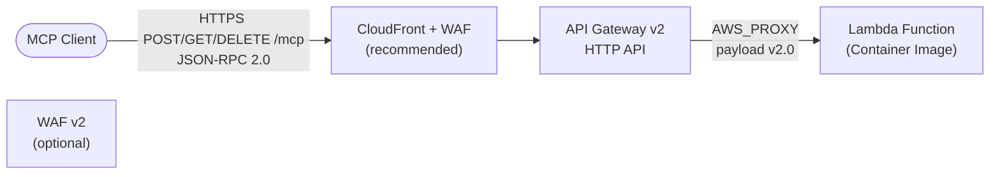
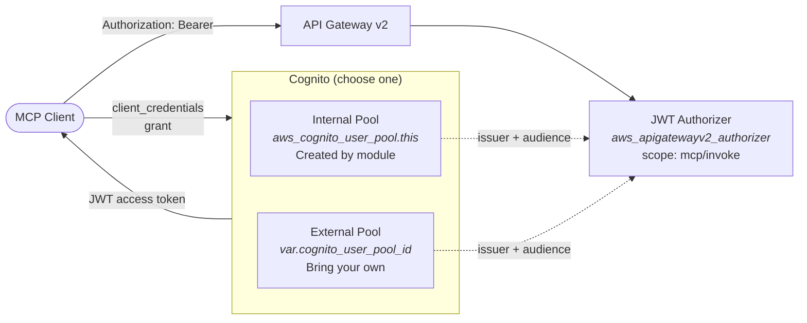
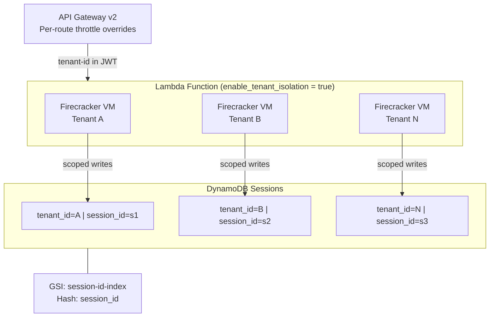
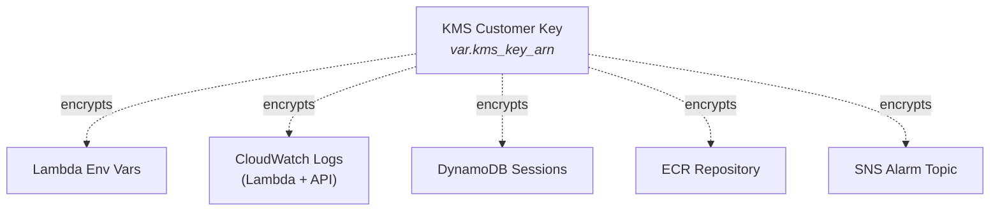
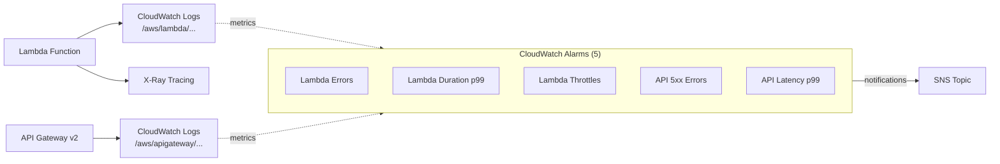
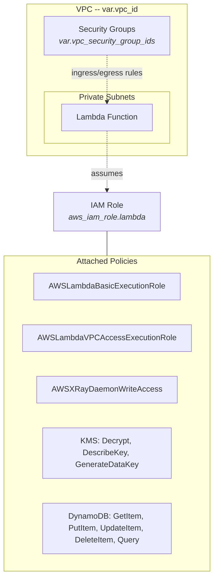

# MCP Server Architecture

## 1. Request Flow

The primary request path from MCP client to Lambda function.

**Route mapping** (MCP spec 2025-03-26):

| Route | Purpose |
| --- | --- |
| `POST /mcp` | JSON-RPC requests and notifications |
| `GET /mcp` | SSE streaming endpoint |
| `DELETE /mcp` | Session termination |

---

## 2. Authentication

Cognito JWT authorization with internal or external user pools.

- **Internal pool**: Module creates Cognito user pool, domain, resource server, and client. Best for standalone deployments.
- **External pool**: Set `cognito_user_pool_id`, `cognito_user_pool_endpoint`, and `cognito_client_id`. Best for centralized identity planes.

---

## 3. Multi-Tenant Isolation

Hardware-level tenant isolation via Firecracker VMs and data partitioning.

- **Lambda**: `TenancyConfig.TenantIsolationMode = PER_TENANT` -- each tenant gets a dedicated Firecracker micro-VM. Immutable after creation.
- **DynamoDB**: Composite key `tenant_id` (hash) + `session_id` (range) enables `dynamodb:LeadingKeys` IAM conditions for row-level isolation.
- **API Gateway**: `route_throttle_overrides` map applies per-route rate/burst limits for noisy neighbor protection.

---

## 4. Encryption

Single KMS key encrypts all data at rest (SC-28).

---

## 5. Observability

CloudWatch alarms, X-Ray tracing, and structured logging.

| Alarm | Metric | Threshold |
| --- | --- | --- |
| Lambda Errors | `Errors` Sum | > 5 per 5 min |
| Lambda Duration p99 | `Duration` p99 | > 80% of timeout |
| Lambda Throttles | `Throttles` Sum | > 5 per 5 min |
| API 5xx | `5xx` Sum | > 10 per 5 min |
| API Latency p99 | `Latency` p99 | > 90% of timeout |

---

## 6. Network & IAM

VPC placement and least-privilege IAM.

---

## FedRAMP Control Mapping

| Control | ID | Implementation |
| --- | --- | --- |
| Boundary Protection | SC-7 | VPC required, CloudFront + WAF recommended (WAFv2 not supported on HTTP API v2), security groups, tenant isolation via Firecracker VMs |
| Transmission Confidentiality | SC-8 | TLS on API Gateway, HTTPS-only |
| Cryptographic Key Management | SC-12/13 | KMS customer-managed key (required) |
| Encryption at Rest | SC-28 | KMS for env vars, logs, DynamoDB, ECR |
| Least Privilege | AC-6 | Scoped IAM role, no wildcard actions |
| Audit Logging | AU-2/3 | CloudWatch logs + API Gateway access logs |
| Monitoring | SI-4 | X-Ray tracing, 5 CloudWatch alarms |
| Incident Handling | IR-4 | SNS alarm notifications |
| Authentication | IA-2/8 | Cognito OAuth 2.0 JWT authorizer (internal or external pool) |
| Least Functionality | CM-7 | Reserved concurrency, timeouts, per-route throttling |
| Tenant Isolation | SC-7 | Firecracker VM per tenant when `enable_tenant_isolation = true` |

## Known Limitations

- **WAFv2 not supported on HTTP API v2**: The `aws_wafv2_web_acl_association` resource will fail at apply time if `waf_acl_arn` is provided. WAFv2 only supports REST APIs for API Gateway. Place a CloudFront distribution in front of the HTTP API and associate WAF with CloudFront instead.
- **30-second hard integration timeout**: HTTP API v2 has an immutable 30-second maximum integration timeout. This impacts the `GET /mcp` SSE streaming endpoint -- long-lived connections are forcibly closed. Mitigations: (1) polling/chunked-response pattern, (2) REST API with response streaming, or (3) Lambda Function URLs with `RESPONSE_STREAM` (incompatible with tenant isolation).
- **Lambda tenancy_config provider support**: GA AWS API feature but may not be supported in all `hashicorp/aws` provider versions. Verify against your pinned version.
- **DynamoDB LeadingKeys not enforced in IAM**: The IAM policy grants broad access without `dynamodb:LeadingKeys` conditions. True IAM-level tenant isolation requires per-invocation STS scoping via the token vending machine pattern.

## Design Decisions

- **Container-only deployment** -- MCP SDKs have large dependency trees; container images are the standard model
- **API Gateway v2 over ALB** -- Native JWT auth, structured logging, throttling, lower cost for serverless
- **VPC required** -- SC-7 boundary protection is mandatory for FedRAMP
- **Stateless by default** -- DynamoDB sessions optional; Streamable HTTP is inherently stateless
- **3 MCP routes** -- POST (requests), GET (SSE), DELETE (session termination) per spec 2025-03-26
- **Cognito client_credentials** -- Standard OAuth 2.0 for machine-to-machine MCP authentication
- **Tenant isolation mode** -- Hardware-level tenant isolation via Firecracker VMs; immutable after creation. Each tenant's MCP execution runs in a dedicated micro-VM for FedRAMP SC-7 boundary protection at the compute layer
- **External Cognito support** -- Allows centralized identity planes for organizations with existing Cognito user pools. Avoids per-deployment pool duplication and enables SSO across multi-tenant platforms
- **Composite DynamoDB key** -- When tenant isolation is enabled, sessions are partitioned by tenant_id for IAM-level isolation via `dynamodb:LeadingKeys`. Each tenant can only access their own session records
- **Per-route throttling** -- Route-level rate limits for noisy neighbor protection without impacting healthcheck or admin routes. Each route key (e.g., `POST /mcp`) can have independent rate and burst limits
