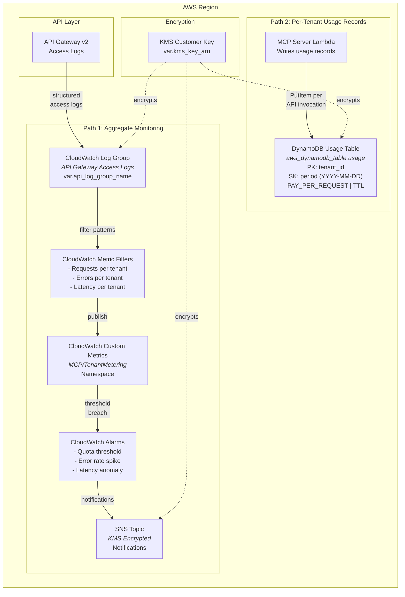

# MCP Tenant Metering Architecture

## FedRAMP Control Mapping

| Control | ID | Implementation |
| --- | --- | --- |
| Audit Events | AU-2 | All tenant API invocations logged via API Gateway access logs |
| Content of Audit Records | AU-3 | Structured JSON logs include tenant_id, method, status, latency |
| System Monitoring | SI-4 | CloudWatch metric filters track per-tenant request rates, errors, and latency |
| Least Functionality | CM-7 | Quota alarms enable usage-based throttling and capacity controls |
| Incident Handling | IR-4 | SNS notifications on quota breaches and error rate spikes for automated response |

## Design Decisions

- **Dual data paths** -- Aggregate monitoring (Path 1) uses CloudWatch metric filters for real-time dashboards and alarms, while per-tenant usage records (Path 2) use DynamoDB for precise billing and quota enforcement. This separation optimizes for different query patterns
- **CloudWatch metric filters over custom metrics SDK** -- Metric filters extract tenant-level metrics directly from API Gateway access logs without modifying application code. This decouples metering from the MCP server implementation
- **DynamoDB usage table with composite key** -- `tenant_id` (partition key) + `period` (sort key, formatted as YYYY-MM-DD) enables efficient range queries for billing periods while maintaining tenant isolation via `dynamodb:LeadingKeys`
- **PAY_PER_REQUEST billing** -- Usage tables have unpredictable write patterns (correlated with tenant API activity). On-demand billing avoids capacity planning and auto-scales with traffic
- **TTL for automatic cleanup** -- Usage records older than the retention period are automatically deleted by DynamoDB TTL, reducing storage costs and satisfying data minimization requirements
- **KMS encryption for all storage** -- CloudWatch logs, DynamoDB, and SNS topics are encrypted with the shared KMS customer-managed key for consistent encryption posture (SC-28)
- **Alarm-driven quota enforcement** -- Rather than inline throttling, quota breaches trigger SNS notifications that can invoke remediation Lambda functions or alert operators. This provides flexibility without coupling quota logic to the request path
