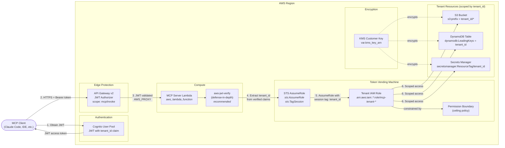
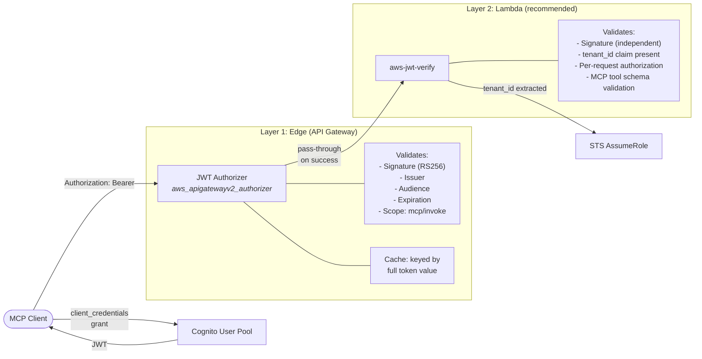
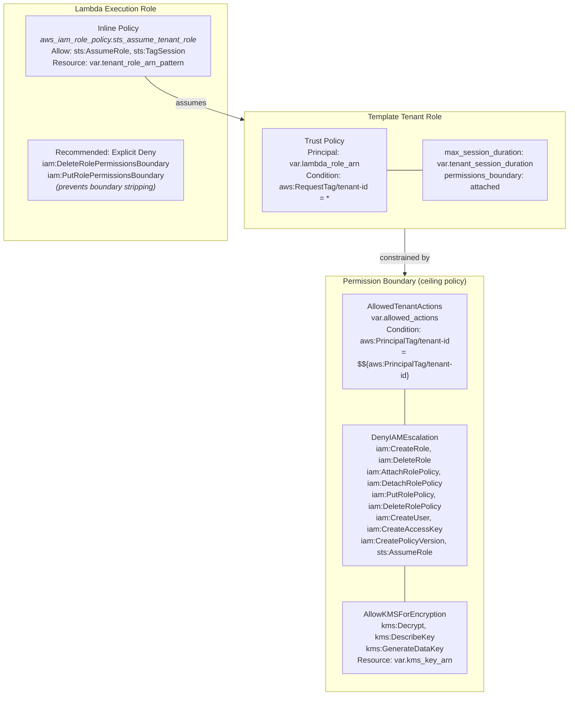
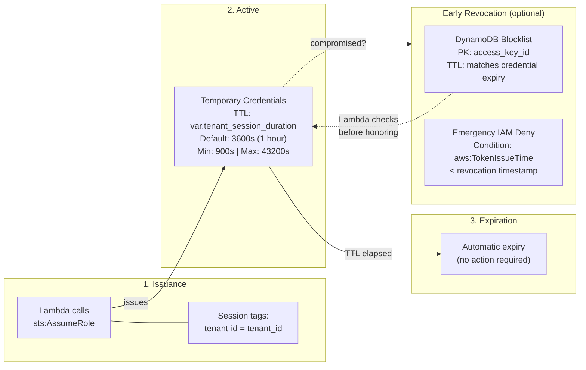
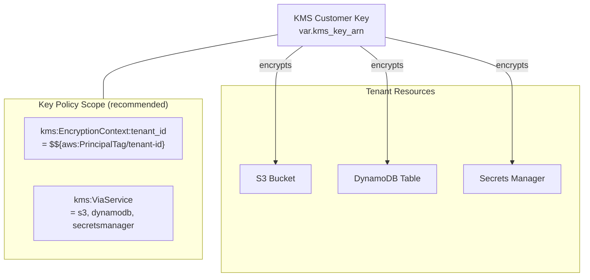
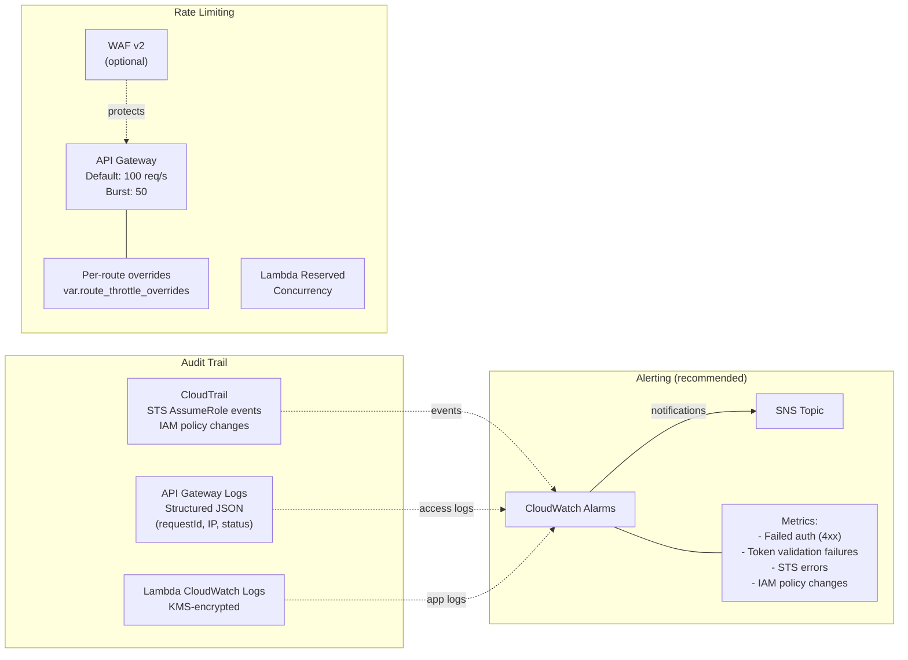

# MCP Token Vending Machine Architecture

The Token Vending Machine (TVM) vends short-lived, tenant-scoped AWS credentials from a trusted Lambda function. It uses STS session tags and IAM permission boundaries to enforce tenant isolation without per-tenant IAM user management.

## 1. Token Vending Flow

End-to-end credential vending path from MCP client to tenant-scoped resources.

**Step-by-step:**

1. MCP client authenticates with Cognito using `client_credentials` grant, receiving a JWT with `tenant_id` claim and `mcp/invoke` scope.
2. Client sends request to API Gateway v2 with `Authorization: Bearer <JWT>`.
3. API Gateway JWT authorizer validates token signature, issuer, audience, and expiration at the edge.
4. Lambda performs defense-in-depth server-side JWT signature verification using `aws-jwt-verify`, then extracts `tenant_id` from verified claims.
5. Lambda calls `sts:AssumeRole` with `tenant-id` session tag on the matching tenant role.
6. Tenant role credentials provide scoped access to tenant resources, constrained by the permission boundary.

---

## 2. Authentication & Authorization

Dual-layer JWT validation with defense-in-depth model.

- **Defense-in-depth (Layer 2):** Even if the API Gateway authorizer is misconfigured or disabled during development (`enable_auth = false`), the Lambda independently validates the JWT. This prevents tenant impersonation via manipulated `tenant_id` claims.
- **Authorizer caching:** API Gateway v2 JWT authorizers cache authorization decisions keyed by the **full token value**. Two different JWTs (even from the same user) get separate cache entries, eliminating cross-tenant cache pollution without additional configuration.
- **MCP-specific controls (recommended):**
  - **Per-request authorization** -- verify JWT `tenant_id` claim matches the requested resource scope on every request, not just at token issuance
  - **Tool schema validation** -- validate MCP tool inputs against expected schemas before execution to prevent prompt injection attacks
  - **Session management** -- MCP spec (2025-03-26) states servers MUST NOT use sessions for authentication; track session IDs for observability only
- **Cognito hardening (recommended):**
  - Disable self-registration unless intentional for the use case
  - Enforce MFA for high-privilege tenants
  - Use short token lifetimes to limit replay windows
  - Disable `"none"` algorithm in JWT validation (Cognito does this by default)

---

## 3. Tenant Isolation & Permission Boundaries

IAM isolation model with three defense layers.

- **Permission boundary enforcement:** The `DenyIAMEscalation` statement explicitly blocks all IAM role/policy modification actions and `sts:AssumeRole`. This prevents a compromised tenant credential from removing its permission boundary, creating new roles, or chaining further role assumptions.
- **Recommended Lambda role hardening:** Add explicit deny statements to the Lambda execution role preventing `iam:DeleteRolePermissionsBoundary` and `iam:PutRolePermissionsBoundary` on tenant roles. This prevents the Lambda from being used as a vector to strip permission boundaries before assuming roles.
- **Session tag security:** Session tags are set by the trusted Lambda, not by the caller. The tenant role trust policy requires `aws:RequestTag/tenant-id` via `StringLike` condition, ensuring every assumption carries tenant context.
- **No wildcard IAM actions:** The `allowed_actions` variable validates that every action matches the `service:Action` pattern with no wildcards (enforced by regex validation in `variables.tf`).

---

## 4. Token Lifecycle & Revocation

STS credential lifecycle management and revocation strategies.

- **No native STS revocation:** AWS STS does not support revoking temporary credentials before expiration. Once issued, credentials remain valid until `tenant_session_duration` expires.
- **Mitigation 1 -- Short TTL:** Default `tenant_session_duration` is 3600s (1 hour). For high-security environments, reduce to 900s (15 minutes). The variable enforces bounds: minimum 900s, maximum 43200s.
- **Mitigation 2 -- DynamoDB blocklist (optional):** For environments requiring immediate revocation, implement an optional DynamoDB blocklist table. The MCP server Lambda checks the blocklist before honoring any tenant credential. Blocklisted access key IDs are stored with a TTL matching the credential's original expiration for automatic cleanup.
- **Mitigation 3 -- Emergency IAM deny:** Attach an inline deny policy to the tenant role that denies all actions for sessions issued before a specific time using `aws:TokenIssueTime` condition. This is an operational procedure for emergency response, not automated infrastructure.

---

## 5. Encryption & KMS Scope

KMS encryption with tenant-scoped key policy recommendations.

- **Current implementation:** The permission boundary grants `kms:Decrypt`, `kms:DescribeKey`, and `kms:GenerateDataKey` scoped to the specific `var.kms_key_arn`. This prevents tenant roles from using any other KMS keys.
- **Tenant-scoped key policies (recommended):** Add KMS key policy conditions that restrict operations based on `kms:EncryptionContext:tenant_id` matching `${aws:PrincipalTag/tenant-id}`. This ensures a tenant can only encrypt/decrypt data tagged with their own tenant ID. Requires all encryption operations to include `tenant_id` in the encryption context.
- **Service restriction (recommended):** Add `kms:ViaService` condition to restrict KMS usage to specific AWS services (S3, DynamoDB, Secrets Manager), preventing direct KMS API calls from tenant credentials.
- **Key rotation:** Use AWS KMS automatic key rotation (annual). Re-encryption of existing data is handled transparently by AWS services that use envelope encryption.

---

## 6. Observability, Auditing & Rate Limiting

Audit trail, rate limiting, and alerting for security monitoring.

- **CloudTrail logging:** CloudTrail records all `sts:AssumeRole` calls with session tags, providing a complete audit trail of credential vending. Recommended additional capture:
  - Failed authentication attempts (API Gateway 401/403 responses)
  - Token validation failures (Lambda-side `aws-jwt-verify` rejections)
  - 4xx/5xx error patterns (from API Gateway access logs)
  - IAM policy changes (CloudTrail management events for `iam:*Policy*` actions)
- **Rate limiting:** The MCP server module implements multi-layer rate limiting:
  - API Gateway default throttling (100 req/s, burst 50)
  - Per-route overrides via `route_throttle_overrides` for noisy neighbor protection
  - Optional WAF v2 for credential stuffing and token exhaustion prevention
  - Lambda reserved concurrency as a hard ceiling
- **IMDS protection:** Lambda functions enforce IMDSv2-only access by default at the platform level. No module configuration is required, but this is documented for FedRAMP audit evidence (protecting against SSRF credential theft vectors).
- **SIEM integration (recommended):** Stream CloudTrail and API Gateway access logs to a centralized SIEM for cross-tenant correlation and anomaly detection.

---

## FedRAMP Control Mapping

| Control | ID | Implementation |
| --- | --- | --- |
| Least Privilege | AC-6 | STS session tags scope credentials to `tenant_id`; permission boundary caps max permissions; `DenyIAMEscalation` prevents privilege escalation |
| Account Management | AC-2 | Template-based tenant roles; no standing credentials; STS tokens with configurable TTL (default 3600s, min 900s) |
| Session Management | AC-12 | STS credential TTL enforcement (900s--43200s); MCP session management per spec; no persistent sessions for authentication |
| Identification and Authentication | IA-2/8 | Dual-layer JWT validation: API Gateway v2 JWT authorizer (edge) + Lambda-side `aws-jwt-verify` (recommended defense-in-depth); Cognito OAuth 2.0 |
| Boundary Protection | SC-7 | IAM policy conditions enforce tenant isolation at resource level; permission boundary prevents cross-tenant access |
| Cryptographic Key Management | SC-12/13 | KMS customer-managed key with tenant-scoped key policy conditions (recommended); `kms:EncryptionContext` for per-tenant isolation |
| Encryption at Rest | SC-28 | KMS encryption for S3, DynamoDB, and Secrets Manager tenant data |
| Audit Logging | AU-2/3 | CloudTrail records STS AssumeRole with session tags; API Gateway structured JSON access logs; Lambda CloudWatch logs (KMS-encrypted) |
| System Monitoring | SI-4 | CloudWatch alarms for failed auth, token validation failures, error rates; X-Ray tracing; SIEM integration (recommended) |
| Least Functionality | CM-7 | API Gateway rate limiting (100 req/s default); per-route throttle overrides; Lambda reserved concurrency; optional WAF v2 |
| Incident Handling | IR-4 | SNS notifications on security events; optional DynamoDB credential blocklist for emergency revocation; `aws:TokenIssueTime` IAM deny for emergency response |

## Design Decisions

- **STS AssumeRole with session tags** -- The TVM uses `sts:AssumeRole` with `tenant_id` as a session tag rather than creating per-tenant IAM users. This provides short-lived, scoped credentials without credential management overhead
- **Permission boundaries as ceilings** -- Permission boundaries define the maximum permissions any tenant role can have. The `DenyIAMEscalation` statement blocks 10 IAM modification actions, preventing privilege escalation even if the role policy is misconfigured
- **Template tenant roles** -- Tenant roles use IAM policy variables (`${aws:PrincipalTag/tenant_id}`) to scope access dynamically. A single role definition serves all tenants without per-tenant role creation
- **Zero-trust multi-tenancy** -- Every tenant credential is independently scoped. No tenant can access another tenant's resources even if they obtain the other tenant's role ARN, because session tags are set by the trusted Lambda (not the caller)
- **Role ARN pattern matching** -- `tenant_role_arn_pattern` uses wildcards to allow the Lambda to assume any matching tenant role while preventing assumption of unrelated roles
- **No standing credentials** -- STS tokens expire automatically (default 1 hour). There are no long-lived access keys to rotate or revoke
- **Dual-layer JWT validation (defense-in-depth)** -- API Gateway v2 validates JWT at the edge, but Lambda should independently re-validate using `aws-jwt-verify`. This ensures token integrity even if the API Gateway authorizer is misconfigured, disabled during development, or bypassed via direct Lambda invocation
- **API Gateway v2 authorizer cache by full token** -- Unlike REST API Lambda authorizers that cache by a configurable identity source (which could cause cross-tenant cache hits), HTTP API v2 JWT authorizers cache by the entire token value. This eliminates cross-tenant cache pollution without additional configuration
- **Optional DynamoDB credential blocklist** -- STS does not support native credential revocation. For environments requiring immediate revocation, an optional DynamoDB blocklist table enables the Lambda to reject credentials before their natural expiration. TTL on blocklist entries ensures automatic cleanup
- **Permission boundary immutability** -- The `DenyIAMEscalation` statement prevents tenant credentials from modifying IAM roles, policies, or permission boundaries. Additionally, the Lambda execution role should deny `iam:DeleteRolePermissionsBoundary` and `iam:PutRolePermissionsBoundary` to prevent the Lambda itself from being used to strip boundaries
- **Tenant-scoped KMS encryption context** -- Recommended use of `kms:EncryptionContext:tenant_id` in KMS key policies ensures that even with KMS permissions, a tenant can only decrypt data encrypted with their own tenant ID in the encryption context
- **MCP-specific input validation** -- Tool schema validation at the Lambda layer prevents prompt injection attacks by validating MCP tool inputs against expected schemas before execution. This follows MCP security best practices for tool poisoning detection
- **IMDS protection** -- Lambda's execution environment enforces IMDSv2-only access by default at the platform level. No additional module configuration is needed, but this is documented for FedRAMP audit evidence and protection against SSRF credential theft vectors (e.g., CVE-2025-51591)
