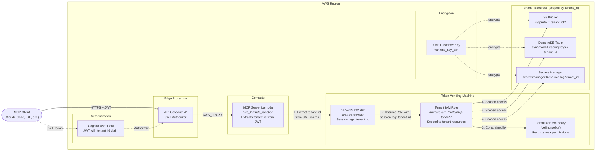

# MCP Token Vending Machine Architecture

## FedRAMP Control Mapping

| Control | ID | Implementation |
| --- | --- | --- |
| Least Privilege | AC-6 | STS session tags scope credentials to tenant_id; permission boundary caps max permissions |
| Account Management | AC-2 | Tenant roles are template-based; no standing credentials; short-lived STS tokens |
| Boundary Protection | SC-7 | IAM policy conditions enforce tenant isolation at the resource level |
| Cryptographic Key Management | SC-12/13 | KMS customer-managed key encrypts all tenant resources |
| Audit Logging | AU-2/3 | CloudTrail records all STS AssumeRole calls with session tags |

## Design Decisions

- **STS AssumeRole with session tags** -- The TVM uses `sts:AssumeRole` with `tenant_id` as a session tag rather than creating per-tenant IAM users. This provides short-lived, scoped credentials without credential management overhead
- **Permission boundaries as ceilings** -- Permission boundaries define the maximum permissions any tenant role can have, preventing privilege escalation even if the role policy is misconfigured
- **Template tenant roles** -- Tenant roles use IAM policy variables (`${aws:PrincipalTag/tenant_id}`) to scope access dynamically. A single role definition serves all tenants without per-tenant role creation
- **Zero-trust multi-tenancy** -- Every tenant credential is independently scoped. No tenant can access another tenant's resources even if they obtain the other tenant's role ARN, because session tags are set by the trusted Lambda (not the caller)
- **Role ARN pattern matching** -- `tenant_role_arn_pattern` uses wildcards to allow the Lambda to assume any matching tenant role while preventing assumption of unrelated roles
- **No standing credentials** -- STS tokens expire automatically (default 1 hour). There are no long-lived access keys to rotate or revoke
