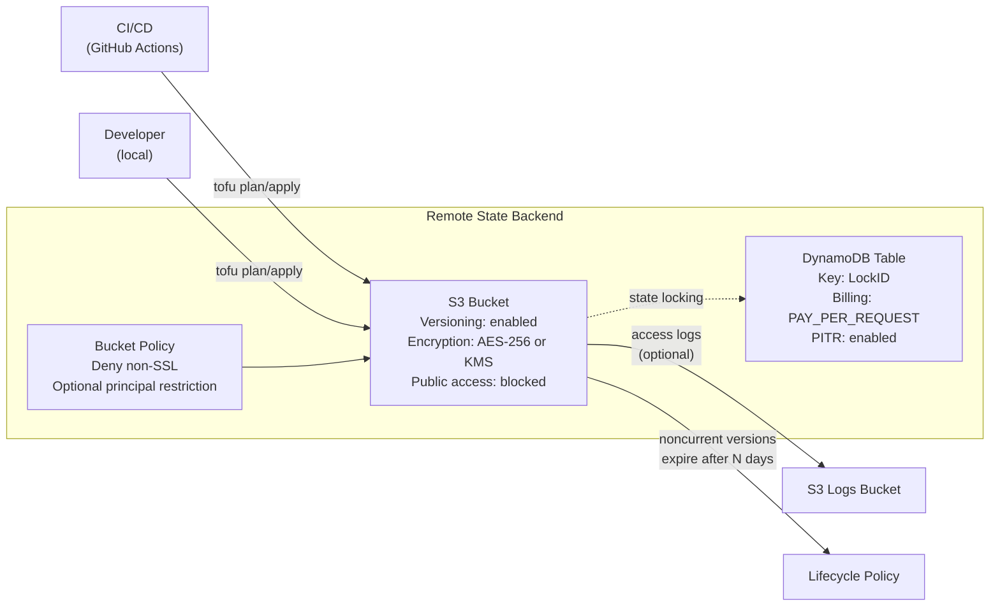

# Remote State Architecture

## Design Decisions

- **SSL enforced**: Bucket policy denies all non-HTTPS requests
- **Versioning**: State files versioned for rollback capability
- **Public access fully blocked**: All four S3 public access block settings enabled
- **Point-in-time recovery**: DynamoDB PITR for lock table disaster recovery
- **PAY_PER_REQUEST**: Avoids DynamoDB capacity planning overhead
- **Noncurrent version expiration**: Defaults to 90 days to limit storage cost
