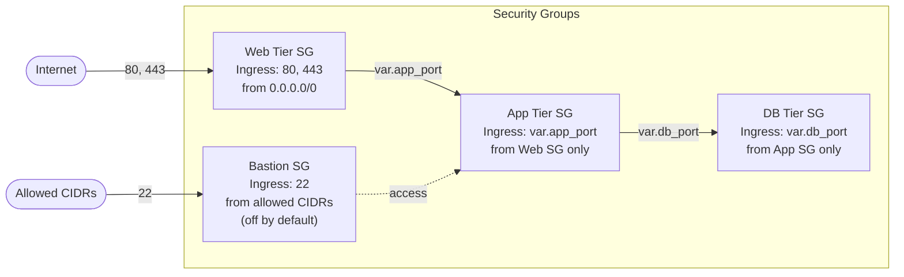
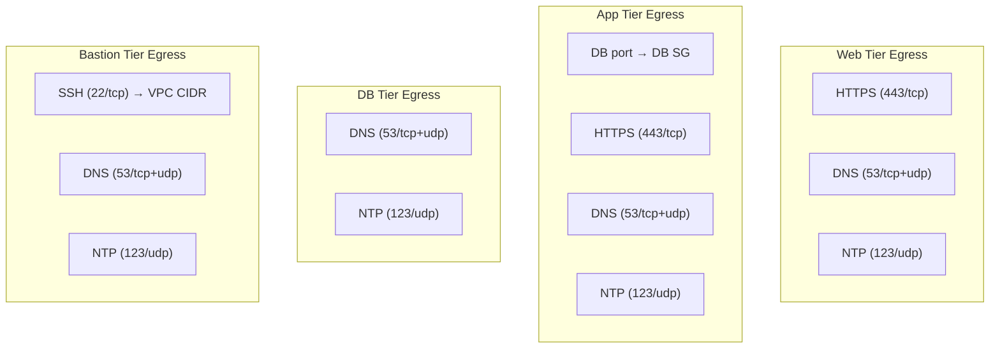

# Security Groups Architecture

## Egress Control

When `restrict_egress = true`:

## Design Decisions

- **Layered access**: Each tier only accepts ingress from the tier above it
- **Bastion off by default**: Must explicitly enable and provide allowed CIDRs
- **Egress**: Unrestricted by default for backwards compatibility; `restrict_egress = true` locks down per tier
- **name_prefix + create_before_destroy**: Prevents downtime during SG replacement
