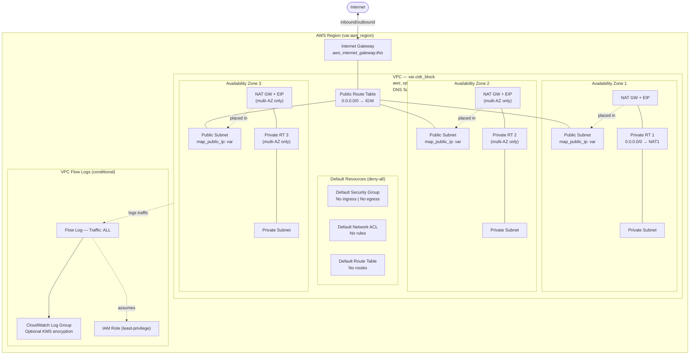

# VPC Architecture

## NAT Gateway Modes

| Mode | `single_nat_gateway` | Resources Created | Recommended For |
| --- | --- | --- | --- |
| Single (default) | `true` | 1 NAT GW, 1 EIP, 1 Private RT | Dev/Staging |
| Multi-AZ HA | `false` | 1 NAT GW + EIP + RT per AZ | Production |

## Design Decisions

- **Default resources managed with deny-all** — prevents use of AWS default SG/NACL/RT which have permissive rules
- **Configurable NAT topology**: Single NAT for cost savings, per-AZ NAT for high availability
- **Configurable `map_public_ip_on_launch`** — defaults to `true`, set `false` to prevent auto-assign
- **Subnet CIDRs** computed dynamically via `cidrsubnet()` in root config
- **3 AZs** selected automatically from available zones in the region
- **VPC Flow Logs** enabled by default for security monitoring
