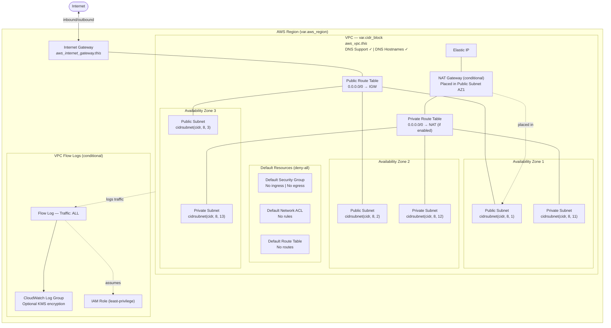

# VPC Architecture

## Design Decisions

- **Default resources managed with deny-all** — prevents use of AWS default SG/NACL/RT which have permissive rules
- **Single NAT Gateway** in AZ1 for cost efficiency — suitable for dev/staging
- **Subnet CIDRs** computed dynamically via `cidrsubnet()` in root config
- **3 AZs** selected automatically from available zones in the region
- **VPC Flow Logs** enabled by default for security monitoring
